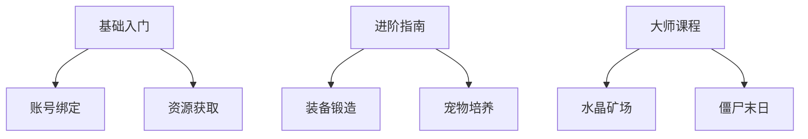

# 服务器A 服务器研究总结

## 开发理念与方向

::: tip 核心原则
- 去数值化：摒弃传统粘液科技模式，引入MINi工业插件实现材料自动化
- 社区驱动：建立玩家小镇系统，鼓励社区协作与文化交流
- 长线运营：采用Bate测试→正式运营的渐进式开发模式
:::

### 技术架构


## 核心系统解析

### 社区管理机制
- **小镇建设**：
  - 镇长资格审查制度
  - 社区活动激励基金
  - 跨小镇交流平台
- **违规处理**：
  - VAC规范严格执行
  - 零容忍政策（无减刑机制）

### RPG系统升级
```json
{
  "装备系统": {
    "继承机制": "旧装备属性可转移至新装备",
    "特色设计": "每件装备拥有独特技能树",
    "强化曲线": "平滑过渡，避免数值断层"
  }
}
```

## 版本规划

### 开发阶段
| 阶段 | 时间范围 | 核心任务 |
|------|----------|----------|
| Bate构建期 | 2024.02-03 | 基础系统搭建、社区雏形建立 |
| RPG构建期 | 2024.03-06 | 大世界探索、职业系统实装 |
| 架构完善期 | 2024.06-07 | 经济系统深度开发 |

### 重要更新
- 新增热带群系改造（金合欢树林）
- 引入大象/河马/牦牛等生物
- 四星级装备「命运齿轮」实装

::: warning 注意事项
开服初期将采取不删档测试机制，但保留因重大BUG回滚数据的权利
:::

## 运营策略

### 商业模型
- 会员服务：支持旧版会员迁移
- 赞助体系：仅维持服务器基本运维

### 技术保障
- 网络防护：DDoS防御系统
- 性能优化：生电设备白名单机制

## 研究价值
1. 社区驱动型服务器的运营范式
2. 去数值化RPG系统的实现路径
3. 长线运营版本规划方法论

---

## 教程制作规范

### 分层教学体系


### 内容设计标准
1. **渐进式难度曲线**：
   - 每日任务→每周任务→赛季目标
   - 装备制造需求等级阶梯分布

2. **可视化数据示例**：
```json
{
  "装备强化": {
    "成功率公式": "(基础概率) + (幸运值/100)",
    "材料消耗": "每级增长15%"
  }
}
```

::: warning 版本适配
教程更新需与服务器版本严格同步，保留3个历史版本存档
:::